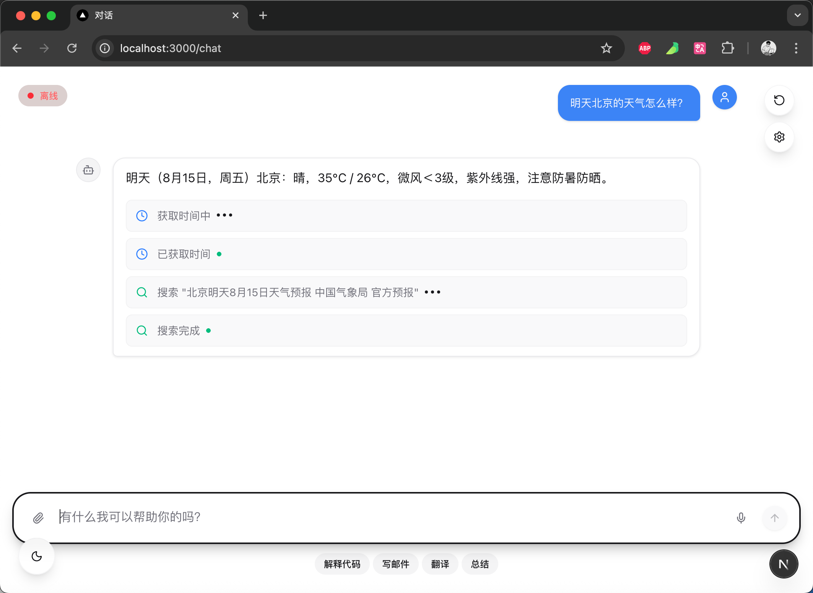
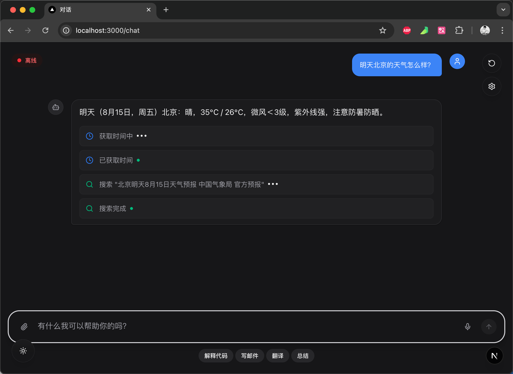

# 简单智能问答系统

[中文](README.md) | [English](README_EN.md)

---

基于 LangGraph 和 Next.js 构建的全栈智能问答系统，提供实时流式响应和工具集成功能。

## 🚀 特性

- **智能问题处理**：自动分析和优化用户问题
- **实时流式响应**：使用服务器发送事件实现实时响应流
- **工具集成**：可扩展的工具系统，增强功能性
- **现代化界面**：简洁响应式界面，支持深色/浅色主题
- **全栈架构**：FastAPI 后端 + Next.js 前端

## 📸 项目展示

### 浅色主题



### 深色主题



## 🏗️ 项目架构

```
├── backend/          # FastAPI 后端
│   ├── app/
│   │   ├── api.py           # API 路由
│   │   ├── graph.py         # LangGraph 工作流
│   │   ├── nodes/           # 图节点
│   │   ├── schema.py        # 数据模型
│   │   └── tools.py         # 工具实现
│   └── pyproject.toml       # Python 依赖
└── frontend/         # Next.js 前端
    ├── src/
    ├── package.json         # Node.js 依赖
    └── next.config.ts       # Next.js 配置
```

## 🛠️ 技术栈

**后端：**

- FastAPI - 现代 Python Web 框架
- LangGraph - 工作流编排
- LangChain - LLM 集成
- Pydantic - 数据验证

**前端：**

- Next.js 15 - React 框架
- TypeScript - 类型安全
- Tailwind CSS - 样式框架
- Radix UI - 组件库

## 📦 安装

### 环境要求

- Python 3.12+
- Node.js 18+
- pnpm（推荐）

### 后端设置

```bash
cd backend
pip install uv  # 或使用你偏好的 Python 包管理器
uv sync
```

### 前端设置

```bash
cd frontend
pnpm install
```

## 🚀 运行应用

### 启动后端

```bash
cd backend
uv run uvicorn app.main:app --reload --port 8000
```

### 启动前端

```bash
cd frontend
pnpm dev
```

应用将在以下地址可用：

- 前端：http://localhost:3000
- 后端 API：http://localhost:8000
- API 文档：http://localhost:8000/docs

## 📡 API 接口

- `GET /api/` - 健康检查
- `POST /api/chat` - 聊天接口，支持流式响应

### 聊天接口示例

**请求：**

```json
{
  "question": "北京明天天气怎么样？"
}
```

**响应：**
流式响应，包含以下事件类型：

- `chat_event` - 聊天内容
- `tool_event` - 工具调用信息

## 🧪 测试

```bash
# 前端测试
cd frontend
pnpm test

# 运行带 UI 的测试
pnpm test:ui

# 运行单次测试
pnpm test:run
```

## 🔧 配置

1. 复制环境文件：

   ```bash
   cp backend/.env.example backend/.env
   ```

2. 在 `backend/.env` 中配置环境变量：
   ```env
   OPENAI_API_KEY=your_openai_api_key
   TAVILY_API_KEY=your_tavily_api_key
   ```

## 📝 开发说明

### 工作流程

系统使用基于图的工作流，包含以下节点：

1. **Supervisor（监督者）**：分析请求并决定下一步操作
2. **Question Analysis（问题分析）**：优化和分析用户问题
3. **Researcher（研究员）**：使用工具进行信息搜索
4. **Tool Router（工具路由）**：管理工具执行流程
5. **Answer（回答）**：生成最终响应

### 添加新工具

1. 在 `backend/app/tools.py` 中定义新工具
2. 在 `backend/app/nodes/tool_node.py` 中注册工具
3. 更新工具解析器

### 前端开发

前端使用 Next.js 15 和 App Router，主要特性：

- 服务器端渲染
- 实时流式数据处理
- 响应式设计
- 主题切换

## 🐛 故障排除

### 常见问题

1. **后端启动失败**

   - 检查 Python 版本是否为 3.12+
   - 确认所有依赖已正确安装

2. **前端构建错误**

   - 清除缓存：`pnpm clean`
   - 重新安装依赖：`rm -rf node_modules && pnpm install`

3. **API 连接问题**
   - 确认后端服务正在运行
   - 检查 CORS 配置

## 🤝 贡献

欢迎提交 Issue 和 Pull Request！

### 贡献指南

1. Fork 项目
2. 创建功能分支：`git checkout -b feature/amazing-feature`
3. 提交更改：`git commit -m 'Add amazing feature'`
4. 推送到分支：`git push origin feature/amazing-feature`
5. 提交 Pull Request

## 📄 许可证

本项目采用 MIT 许可证 - 查看 [LICENSE](LICENSE) 文件了解详情。

## 📞 联系方式

如有问题或建议，请通过以下方式联系：

- 提交 Issue
- 发送邮件至：hczshd@gmail.com

---

**注意：** 这是一个演示项目，请根据实际需求进行配置和部署。
