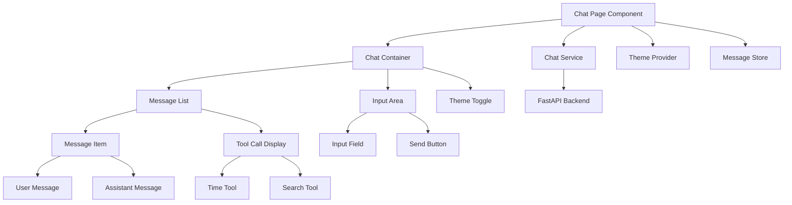

# Design Document

## Overview

本设计文档描述了一个现代化对话界面的技术实现方案。该界面基于 Next.js 14 App Router 架构，使用 Tailwind CSS 4 和 shadcn/ui 组件库构建，通过 POST 请求到 FastAPI 后端获取 SSE 流式数据，支持亮色/暗色主题切换。

核心特性包括：实时流式对话、工具调用状态显示、主题持久化、响应式设计和错误处理。

## API 接口规范

**接口地址**: `http://localhost:8000/api/chat`  
**请求方法**: POST  
**请求格式**: JSON  
**响应格式**: Server-Sent Events (SSE)

### 请求示例

```json
{
  "question": "明天北京天气怎么样？"
}
```

### 响应事件类型

1. **工具调用事件** (`tool_event`)

   - 工具开始调用（`tool_result` 为空）
   - 工具调用完成（包含 `tool_result`）

2. **对话内容事件** (`chat_event`)
   - 流式返回 AI 回答内容

### 响应示例

**工具调用开始**:

```json
{
  "event_name": "tool_event",
  "tool_name": "current_time",
  "tool_param": "",
  "tool_result": ""
}
```

**工具调用完成**:

```json
{
  "event_name": "tool_event",
  "tool_name": "current_time",
  "tool_param": "",
  "tool_result": "2025-08-13 21:21:43"
}
```

**搜索工具调用**:

```json
{
  "event_name": "tool_event",
  "tool_name": "tavily_search",
  "tool_param": "北京明天2025年8月14日天气预报",
  "tool_result": "西城明天天气预报\n平谷镇空气质量- 北京..."
}
```

**AI 回答内容**:

```json
{
  "event_name": "chat_event",
  "content": "明天"
}
```

## Architecture

### 整体架构



### 技术栈架构

- **前端框架**: Next.js 14 (App Router)
- **样式系统**: Tailwind CSS 4
- **UI 组件**: shadcn/ui
- **状态管理**: React useState + useReducer
- **主题管理**: next-themes
- **数据传输**: Fetch API + SSE
- **类型系统**: TypeScript

## Components and Interfaces

### 核心组件结构

#### 1. ChatPage (页面组件)

```typescript
// src/app/chat/page.tsx
interface ChatPageProps {}

// 主要职责：
// - 初始化聊天状态
// - 管理全局状态
// - 处理路由和 SEO
```

#### 2. ChatContainer (容器组件)

```typescript
// src/components/chat/ChatContainer.tsx
interface ChatContainerProps {
  className?: string;
}

// 主要职责：
// - 布局管理
// - 消息状态管理
// - SSE 事件处理
// - 工具调用状态管理
```

#### 3. MessageList (消息列表)

```typescript
// src/components/chat/MessageList.tsx
interface MessageListProps {
  messages: Message[];
  toolCalls: ToolCall[];
  isStreaming: boolean;
}

// 主要职责：
// - 渲染消息历史
// - 显示工具调用状态
// - 自动滚动管理
```

#### 4. MessageItem (消息项)

```typescript
// src/components/chat/MessageItem.tsx
interface MessageItemProps {
  message: Message;
  isStreaming?: boolean;
}

// 主要职责：
// - 渲染单条消息
// - 支持流式内容更新
// - 消息类型区分显示
```

#### 5. ToolCallDisplay (工具调用显示)

```typescript
// src/components/chat/ToolCallDisplay.tsx
interface ToolCallDisplayProps {
  toolCall: ToolCall;
}

// 主要职责：
// - 显示工具调用状态
// - 区分不同工具类型
// - 显示调用参数和结果
```

#### 6. ChatInput (输入组件)

```typescript
// src/components/chat/ChatInput.tsx
interface ChatInputProps {
  onSendMessage: (message: string) => void;
  disabled: boolean;
  placeholder?: string;
}

// 主要职责：
// - 消息输入处理
// - 发送状态管理
// - 键盘事件处理
```

#### 7. ThemeToggle (主题切换)

```typescript
// src/components/ui/ThemeToggle.tsx
interface ThemeToggleProps {
  className?: string;
}

// 主要职责：
// - 主题切换控制
// - 图标状态更新
// - 用户偏好保存
```

### 服务层接口

#### Chat Service

```typescript
// src/services/chatService.ts
interface ChatService {
  sendMessage(question: string): Promise<ReadableStream>;
  parseSSEEvent(data: string): SSEEvent | null;
}

interface ChatRequest {
  question: string;
}
```

#### Theme Service

```typescript
// src/services/themeService.ts
interface ThemeService {
  getTheme(): "light" | "dark" | "system";
  setTheme(theme: "light" | "dark" | "system"): void;
  toggleTheme(): void;
  subscribeToChanges(callback: (theme: string) => void): () => void;
}
```

## Data Models

### API 数据模型

```typescript
// src/types/api.ts
interface ChatRequest {
  question: string;
}

interface SSEEvent {
  event_name: "tool_event" | "chat_event";
  tool_name?: "current_time" | "tavily_search";
  tool_param?: string;
  tool_result?: string;
  content?: string;
}

// 工具调用事件
interface ToolEvent extends SSEEvent {
  event_name: "tool_event";
  tool_name: "current_time" | "tavily_search";
  tool_param: string;
  tool_result: string;
}

// 对话内容事件
interface ChatEvent extends SSEEvent {
  event_name: "chat_event";
  content: string;
}
```

### 前端数据模型

```typescript
// src/types/chat.ts
interface Message {
  id: string;
  type: "user" | "assistant";
  content: string;
  timestamp: number;
  status: "sending" | "sent" | "streaming" | "complete" | "error";
}

interface ToolCall {
  id: string;
  name: "current_time" | "tavily_search";
  param: string;
  result: string;
  timestamp: number;
  status: "calling" | "complete";
  displayName: string; // "正在获取当前时间" | "正在搜索"
}

interface ChatState {
  messages: Message[];
  currentToolCalls: ToolCall[];
  isConnected: boolean;
  isStreaming: boolean;
  error: string | null;
}
```

### 主题数据模型

```typescript
// src/types/theme.ts
type Theme = "light" | "dark" | "system";

interface ThemeConfig {
  theme: Theme;
  systemTheme: "light" | "dark";
  resolvedTheme: "light" | "dark";
}
```

## Error Handling

### 错误类型定义

```typescript
// src/types/errors.ts
interface ChatError {
  type: "connection" | "timeout" | "server" | "validation";
  message: string;
  code?: string;
  timestamp: number;
}

interface ErrorBoundaryState {
  hasError: boolean;
  error: Error | null;
  errorInfo: ErrorInfo | null;
}
```

### 错误处理策略

1. **网络连接错误**

   - 自动重试机制
   - 连接状态指示
   - 手动重试选项

2. **消息发送错误**

   - 重试机制
   - 错误状态显示
   - 用户友好的错误提示

3. **SSE 流处理错误**

   - 流中断恢复
   - 数据解析错误处理

4. **主题切换错误**
   - 回退到默认主题
   - 本地存储错误处理

## Testing Strategy

### 单元测试

```typescript
// 测试覆盖范围：
// - 组件渲染测试
// - 用户交互测试
// - 状态管理测试
// - API 服务测试
// - 工具函数测试

// 测试工具：
// - Jest
// - React Testing Library
// - MSW (Mock Service Worker)
```

### 集成测试

```typescript
// 测试场景：
// - SSE 流数据处理
// - 工具调用状态显示
// - 主题切换功能
// - 消息发送和接收流程
// - 错误处理流程

// 测试工具：
// - Playwright
// - Cypress (可选)
```

### E2E 测试

```typescript
// 测试场景：
// - 完整对话流程
// - 工具调用展示
// - 主题持久化
// - 响应式设计
// - 错误恢复

// 测试工具：
// - Playwright
```

## Implementation Details

### 文件结构

```
src/
├── app/
│   ├── chat/
│   │   └── page.tsx              # 对话页面
│   ├── globals.css               # 全局样式
│   └── layout.tsx                # 根布局
├── components/
│   ├── chat/
│   │   ├── ChatContainer.tsx     # 对话容器
│   │   ├── MessageList.tsx       # 消息列表
│   │   ├── MessageItem.tsx       # 消息项
│   │   ├── ToolCallDisplay.tsx   # 工具调用显示
│   │   └── ChatInput.tsx         # 输入组件
│   └── ui/
│       ├── ThemeToggle.tsx       # 主题切换
│       ├── Button.tsx            # 按钮组件 (shadcn/ui)
│       ├── Input.tsx             # 输入框组件 (shadcn/ui)
│       ├── Card.tsx              # 卡片组件 (shadcn/ui)
│       └── Skeleton.tsx          # 骨架屏组件 (shadcn/ui)
├── services/
│   ├── chatService.ts            # 聊天服务
│   └── themeService.ts           # 主题服务
├── hooks/
│   ├── useChat.ts                # 对话 Hook
│   ├── useSSE.ts                 # SSE Hook
│   └── useTheme.ts               # 主题 Hook
├── types/
│   ├── api.ts                    # API 类型定义
│   ├── chat.ts                   # 对话类型定义
│   ├── theme.ts                  # 主题类型定义
│   └── errors.ts                 # 错误类型定义
└── utils/
    ├── constants.ts              # 常量定义
    ├── formatters.ts             # 格式化工具
    ├── sseParser.ts              # SSE 解析工具
    └── validators.ts             # 验证工具
```

### 关键技术实现

#### SSE 流处理

```typescript
// 使用 Fetch API 处理 SSE
// 实现流式数据解析
// 处理连接状态
// 管理事件监听器
```

#### 工具调用状态管理

```typescript
// 根据 tool_event 显示不同状态
// current_time: "正在获取当前时间" -> "获取到当前时间为 xxx"
// tavily_search: "正在搜索 xxx" -> "搜索到 x 个结果，正在生成回答"
```

#### 主题系统

```typescript
// 使用 next-themes
// CSS 变量系统
// 本地存储持久化
// 系统主题检测
```

#### 状态管理

```typescript
// useReducer 管理复杂状态
// Context API 共享状态
// 自定义 Hooks 封装逻辑
```

### 性能优化

1. **组件优化**

   - React.memo 防止不必要重渲染
   - useMemo 缓存计算结果
   - useCallback 缓存函数引用

2. **渲染优化**

   - 虚拟滚动（长消息列表）
   - 懒加载组件
   - 代码分割

3. **网络优化**

   - 流式数据处理
   - 错误重试策略
   - 连接状态管理

4. **内存优化**
   - 及时清理事件监听器
   - 限制消息历史长度
   - 组件卸载清理

### 工具调用显示逻辑

```typescript
// 工具调用状态映射
const toolDisplayMap = {
  current_time: {
    calling: "正在获取当前时间",
    complete: (result: string) => `获取到当前时间为 ${result}`,
  },
  tavily_search: {
    calling: (param: string) => `正在搜索 ${param}`,
    complete: (result: string) => {
      const resultCount = result.split("\n").length;
      return `搜索到 ${resultCount} 个结果，正在生成回答`;
    },
  },
};
```
